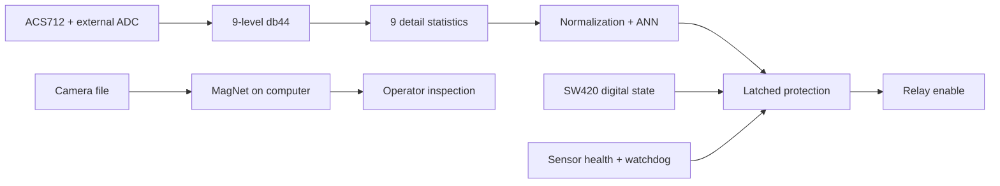

# DWT · ANN · MAV

A runnable research implementation of **FPGA-Based Condition Monitoring of Three Phase Induction motors using DWT-driven Artificial Neural Network, and Motion Amplification Video** (Purbia, Raj, Barnwal, and Singh).

The original exploratory notebooks are retained. The package, tests and RTL are the maintained implementation. The notebooks contain historical preprocessing/label inconsistencies and should not be used as reproduction scripts.

## Implemented

- True **db44, nine-level DWT** with generated 88-tap filters and matching software/hardware features.
- Binary **9 → 32 → 64 → 128 → 64 → 32 → 1 ANN**: five ReLU hidden layers and sigmoid output; defaults of 20 epochs and batch size 32.
- CSV/NPY ingestion, recording-group splits, training-only normalization, validation-selected checkpoints, held-out metrics and measured FFT/time-domain baselines.
- Fixed-point export, Python integer reference, and SystemVerilog ADC/DWT/ANN integration with independent SW420 and latched relay protection.
- Learned **MagNet video magnification** on CPU/CUDA, streaming processing, static/dynamic modes, side-by-side output, and supervised MAV training.
- Python and executable Icarus Verilog tests, including full db44 windows and end-to-end ADC/inference comparisons.

**Research reference, not certified protection equipment.** The paper's 98.70% accuracy, 0.032 loss, sub-millisecond processing and power figures are reference claims, not reproduced results. Original motor recordings, board pin assignments, ADC interface and Quartus timing measurements are not supplied. See [paper mapping](docs/paper_mapping.md) and [hardware integration](docs/hardware.md).



## Install and try

Python 3.10–3.12 is recommended. A GPU is optional.

```bash
python3 -m venv .venv
source .venv/bin/activate
python -m pip install -e '.[video,plots,dev]'
motor-monitor demo --output runs/demo
motor-monitor predict runs/demo/run/model.npz runs/demo/data/synthetic_1_000.npy
motor-monitor verify-fixed runs/demo/run/model.npz runs/demo/data/synthetic_1_000.npy
```

The demo generates **synthetic** signals, trains the full ANN, evaluates both baselines, and exports FPGA memories. Its accuracy is only an integration check; it says nothing about real motor performance. No command actuates a physical relay.

## Train on motor recordings

Create a CSV manifest. Paths are relative to the manifest; each file contains one recording. Input values must be calibrated **amperes**, with one selected current channel.

```csv
path,label,group,split
healthy/run01.csv,0,healthy_session_01,train
faulty/run01.csv,1,fault_session_01,train
healthy/run02.csv,0,healthy_session_02,val
faulty/run02.csv,1,fault_session_02,val
healthy/run03.csv,0,healthy_session_03,test
faulty/run03.csv,1,fault_session_03,test
```

Use `0=healthy`, `1=faulty`. Related captures must share a group. A group cannot span splits. Omit `split` for deterministic approximate 60/20/20 group stratification, with at least three independent groups per class. Mixed-label groups require explicit splits. Overlapping windows remain in their recording's split. Identical file content across splits is rejected.

```bash
motor-monitor train data/manifest.csv --output runs/experiment \
  --sample-rate 2450 --column 0 --epochs 20 --batch-size 32 --plots
motor-monitor predict runs/experiment/model.npz data/new_recording.csv
motor-monitor export-fpga runs/experiment/model.npz --output runs/experiment/fpga
```

CSV is headerless by default; use `--skiprows 1` for a header. Trailing incomplete windows are ignored and prediction reports their count. `model.npz` stores weights and preprocessing, loaded without pickle. Outputs include `report.json`, `history.json`, window/group/hash provenance and optional `evaluation.png`.

For ADC codes, calibrate the example JSON to your actual ADC, divider and sensor:

```bash
motor-monitor convert-adc data/codes.csv --calibration configs/acs712.example.json --output data/current.npy
```

## Motion amplification

The explicit downloader verifies the pretrained model already referenced by the legacy notebook:

```bash
python scripts/download_magnet.py --output runs/magnet.pth
motor-monitor magnify motor.mp4 --checkpoint runs/magnet.pth \
  --output runs/motor-amplified.mp4 --alpha 10 --mode static --side-by-side
```

Output preserves frame count, FPS and dimensions (double width for comparison); audio is not copied. `alpha` is additional gain, approximately `1 + alpha` total displacement. Alpha zero is an exact bypass. See [MAV implementation and training](docs/mav.md) for provenance and restrictions.

## Simulate protection

```bash
motor-monitor replay configs/protection.example.jsonl --watchdog-seconds 60
```

Startup is unarmed; healthy inference plus acknowledgment enables the simulated relay. Fault, vibration, invalid telemetry or expired inference latches trip. Offline replay checks the watchdog on supplied events; a live wrapper needs periodic timer events. Video never drives the relay.

## Test

Install Icarus Verilog (`brew install icarus-verilog` on macOS or `sudo apt-get install iverilog` on Ubuntu):

```bash
python -m pytest -q
ruff check src tests scripts
ruff format --check src tests scripts
```

RTL tests skip if Icarus is absent; CI installs it. Tests exercise repeated windows, exported weights, negative arithmetic, full db44 filters, integrated ADC conversion, sigmoid lookup and independent protection. They do not substitute for synthesis, timing closure, calibration or electrical safety review.

| Path | Purpose |
|---|---|
| `src/dwt_ann_mav/` | Features, training, inference, sensors, fixed-point reference, video |
| `fpga/rtl/` | Board-independent SystemVerilog |
| `scripts/` | Reproducible filter generation and checked checkpoint download |
| `tests/` | Numerical, training, video and executable RTL checks |
| `docs/` | Paper choices, hardware integration and MAV provenance |

Legacy [Colab video demo](https://colab.research.google.com/drive/1Vn2gfWp7UJfAPzhU6yKYQBWXVD8OMJac) and notebooks remain for historical context.
